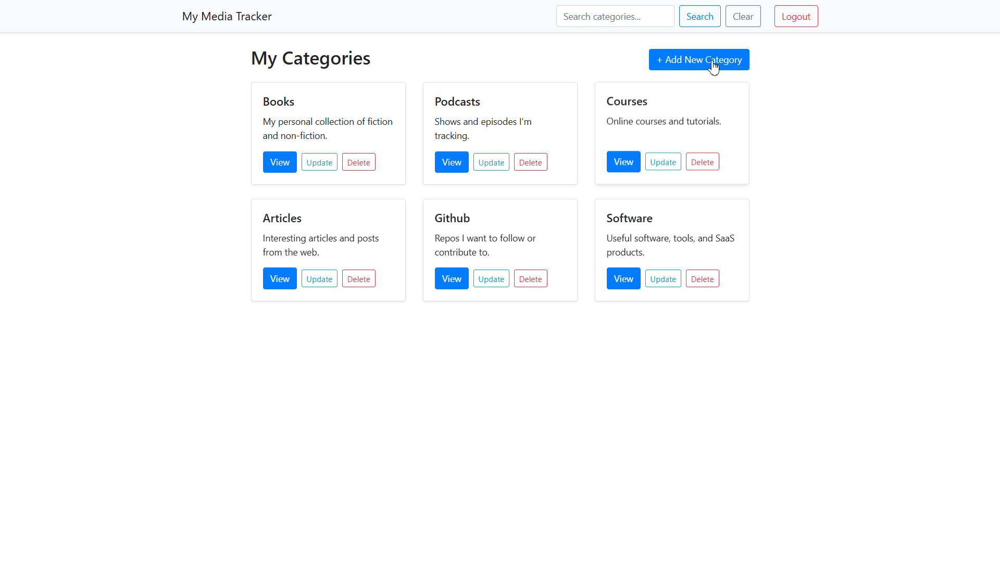

# My Media Tracker 📚🎬🎙️

My Media Tracker is a full-stack web application, built from scratch with FastAPI and React, that allows you to create, manage, and track your personal media collections. 

This app moves beyond simple, pre-defined trackers. It allows you to dynamically create your own categories (like "Books" or "Podcasts") and then define the *exact* fields you want to track for each one (e.g., "Title", "Author", "Status", "Rating", etc).

## 🚀 Live Demo

Here is a simple demonstration of the app's core workflow: creating a new category, dynamically adding fields (columns) to it, and then populating it with new items (rows).



---

## ✨ Key Features

* **Full User Authentication:** Secure signup and login system using `passlib` hashing and JWT tokens. All data is private to the logged-in user.
* **Dynamic 3-Level Data Model:**
    * **Level 1 (Categories):** Full CRUD for high-level collections (e.g., "Books", "People", "Courses").
    * **Level 2 (Fields):** Full CRUD for the "columns" of a category. This allows you to *design* your own tables.
    * **Level 3 (Items):** Full CRUD for the "rows" in your collections.
* **"Smart" Forms:** Forms for adding/updating items and fields are **dynamically generated** based on the data type ("Text", "Number", "Date", "Select") you defined.
* **Robust Data Integrity:**
    * Renaming a field (e.g., "Title" -> "Book Title") automatically migrates all associated item data.
    * Deleting a field (e.g., "Author") automatically removes that data from all items in the category.
* **Dual Search & Filter System:**
    * **Category Search (Homepage):** A global search bar to filter your main category list.
    * **Item Search (Detail Page):** An "inside" search to find items by text in *any* field.
    * **Smart Filtering:** Dynamically generated dropdowns to filter items by `Select` fields (e.g., `Status == "Read"`).
* **Secure API:** All data-related API endpoints are protected and require a valid token.

---

## 🛠️ Tech Stack

### Backend
* **Python 3.11+**
* **FastAPI:** For the high-performance ASGI web server.
* **Tortoise-ORM:** Asynchronous ORM for managing the SQLite database.
* **Pydantic:** For data validation and API "contracts."
* **Passlib\[bcrypt] & python-jose:** For password hashing and JWT token authentication.
* **`fastapi-mail`:** For email functionality.
* **`Faker`:** For database seeding.

### Frontend
* **React 18+**
* **React Router v6:** For all page navigation and protected routes.
* **React Context:** For global state management (Auth, Categories, Updates).
* **`react-bootstrap` & `bootstrap`:** For the responsive UI component library.
* **`react-router-bootstrap`:** To integrate router links with `react-bootstrap` components.

---

## ⚙️ Installation & Setup

To run this project locally, you will need to run two separate applications: the backend API and the frontend client.

### 1. Clone the Repository
```bash
git clone https://github.com/Ahmad-Nayfeh/Media-Tracker
cd media-tracker
````

### 2. Backend Setup

Bash

```
# Navigate to the backend folder
cd backend

# Create and activate a Python virtual environment
python -m venv venv
source venv/bin/activate  # (or .\venv\Scripts\activate on Windows)

# Install all required Python libraries
pip install -r requirements.txt

# Create your secret .env file
# (You must do this for the email server to work)
echo "EMAIL=your-gmail@gmail.com" > .env
echo "PASS=your-16-digit-app-password" >> .env

# Run the seed script to create a new, populated database
python seed.py

# Run the backend server
uvicorn main:app --reload
```

> Your backend API will now be running at `http://127.0.0.1:8000`

### 3. Frontend Setup

Bash

```
# Open a NEW, SEPARATE terminal
# Navigate to the frontend folder
cd front_end

# Install all required npm packages
npm install

# Run the frontend development server
npm start
```

> Your React app will now be running and open in your browser at `http://localhost:3000`

---

## 💡 Future Features

This project is a complete V1, but here are features planned for V2:

- [ ] **Password Reset:** A secure "Forgot Password" flow that emails the user a reset link.
    
- [ ] **Email Verification:** Send a verification link on signup before a user can log in.
    
- [ ] **Column Reordering:** Allow drag-and-drop reordering of Fields (columns) in the item table.
    
- [ ] **Advanced Sorting:** Make all table headers clickable to sort items.
    

---
